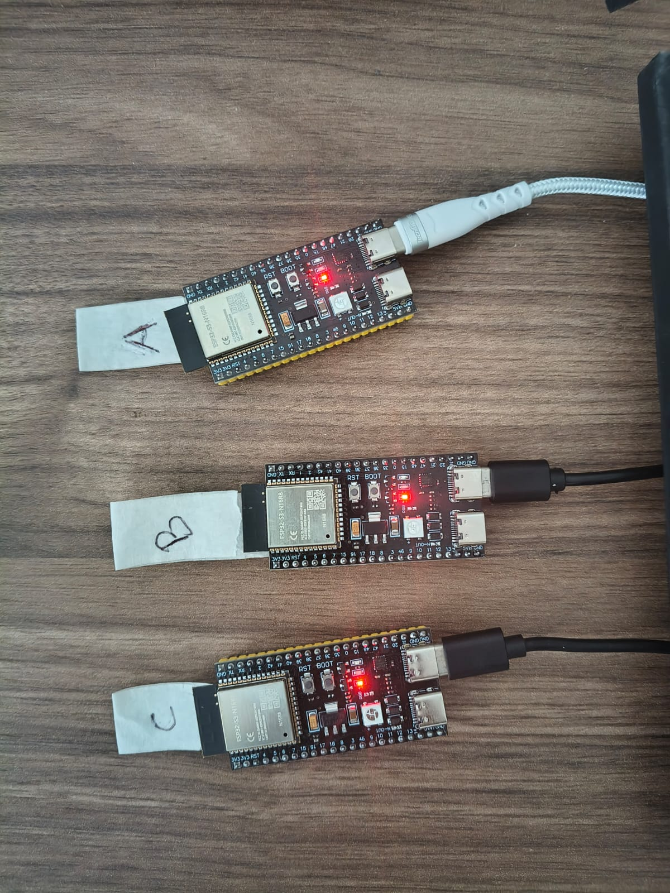
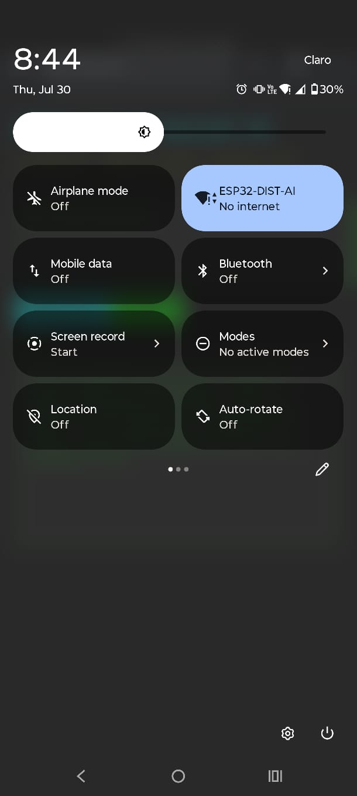
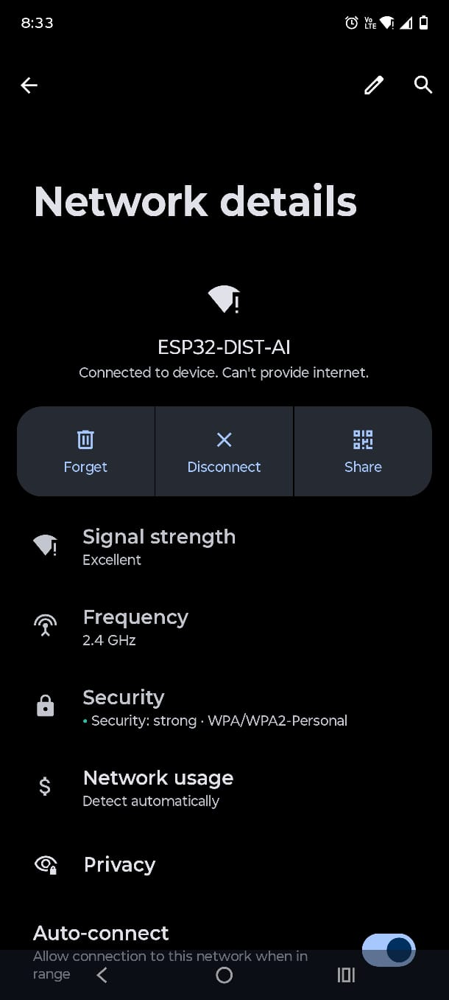
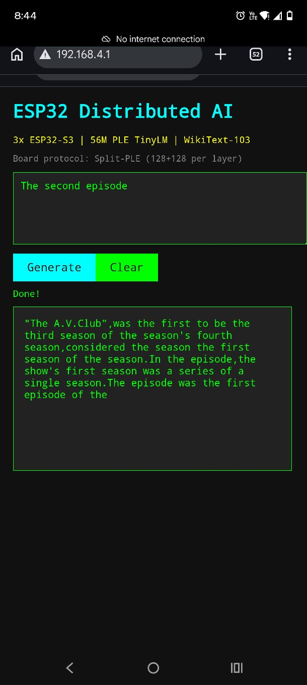

# ESP32-S3 Distributed AI

**Distributed micro-LLM inference across three ESP32-S3 N16R8 boards with ESP-NOW communication.**

---

## Overview

This project implements a **distributed AI system** that runs a **56M-parameter language model** across three ESP32-S3 microcontrollers. Inspired by [slvDev/esp32-ai](https://github.com/slvDev/esp32-ai), which demonstrated running TinyStories on a single board, this project extends the architecture to a multi-board distributed system with web-based interaction.

The model is trained on **WikiText-103** (Wikipedia corpus) using **Per-Layer Embeddings (PLE)** from Google's Gemma architecture, quantized to 4-bit, and split across three boards that communicate via ESP-NOW wireless protocol. The 50.3M-parameter PLE table is split across Board A and Board B (**Split-PLE**) to fit within the 16MB flash per board. Board B maintains a **KV cache** in PSRAM (1.5 MB for 256 positions), enabling the transformer to attend to the full generated sequence instead of operating token-by-token.



---

## Architecture

```
┌───────────────────┐      ESP-NOW      ┌───────────────────┐      ESP-NOW     ┌───────────────────┐
│    Board A        │ ◄──────────────► │    Board B        │ ◄──────────────► │    Board C        │
│   Embeddings +    │                  │   Core + KV Cache │                  │   PLE_A + Decoder │
│   PLE_Proj + Head │                  │                   │                  │   + WiFi          │
│                   │                  │                   │                  │                   │
│ • BPE Tokenizer   │                  │ • 6 Attn layers   │                  │ • PLE table A     │
│ • tok_emb 8-bit   │                  │ • 6 FFN layers    │                  │   (12.5 MB)       │
│ • ple_model_proj  │                  │ • KV Cache (128)  │                  │ • Sampling        │
│ • out_norm + head │                  │ • PLE_B (half)    │                  │ • Web Server      │
│                   │                  │ • PLE Gating      │                  │ • Space heuristic │
│ Flash: 4.31 MB    │                  │ Flash: 13.71 MB   │                  │ Flash: 13.37 MB   │
└───────────────────┘                  └───────────────────┘                  └───────────────────┘
```

### Inference Flow (end-to-end)

```
Browser ──WiFi──► Board C ──ESP-NOW──► Board A ──ESP-NOW──► Board B
                        ◄─────────────── ◄──────────────
```

1. **User** types a prompt in the browser (connected to Board C's WiFi AP) and clicks "Generate"
2. **Board C** receives the prompt via HTTP POST → forwards it to Board A via ESP-NOW (`MSG_EMBED_REQUEST`)
3. **Board A** tokenizes the prompt text → for each token:
   a. Looks up token embedding `x[D]` (8-bit tok_emb)
   b. Computes local PLE projection: `tmpP = ple_model_proj_a @ x`, RMS-norms it
   c. Requests PLE table row from **Board C** via ESP-NOW: sends `token_id` → C looks up `ple_table_a[token]` → sends row back
   d. Combines: `ple = (tmpP + trow * sqrt(Ph)) / sqrt(2)` → sends `token_id + x[D] + ple[L×Ph]` to **Board B**
   e. **Board B** computes PLE_B[L×Ph] from its local table → combines PLE_A + PLE_B into full PLE[L×P] → runs 6 transformer layers (attention + FFN + PLE gating) → sends hidden state `x[D]` back to Board A
   f. **Board A** applies `out_norm` → computes output head: `logits[V] = tok_emb^T · rmsnorm(x)` → sends top-40 token IDs to Board C
   g. **Board C** samples the next token → decodes via BPE vocab → appends to generated output
4. **Board C** streams the generated text to the browser via SSE (`/stream` endpoint)
5. **User** sees the text appear in real-time on the web page

### Split-PLE Design

The 50.3M-parameter PLE table (vocab × layers × 256) is split into two 128-dimension halves:
- **PLE_A** (Board C, 12.5 MB, 4-bit group=64): first 128 dims per layer — reloaded from Board C at runtime via ESP-NOW (MSG_PLE_REQUEST / MSG_PLE_RESULT)
- **PLE_B** (Board B, 12.6 MB, 4-bit group=128): last 128 dims per layer — local on Board B

Board A keeps the small `ple_model_proj` (~50 KB, 4-bit) and `ple_proj_norm` (~0.5 KB, fp32) for local projection. The 12.5 MB PLE table was moved from Board A to Board C to fix partition overflow on Board A and allow upgrading `tok_emb` to 8-bit for better inference quality.

### KV Cache on Board B

Each token in the autoregressive loop previously ran through Board B's transformer with `seq_len=1` — attention only saw the current token, not the history. This crippled coherence because the model was designed for `seq_len=128` context.

Board B now maintains a **KV cache** in PSRAM (1.5 MB for 256 positions):

- For each new token, Q is computed normally, while K and V are appended to per-layer caches
- Attention scores are computed against **all cached positions** (not just the current token)
- RoPE uses the actual position index instead of `pos=0` — for the first time the transformer sees proper position-aware attention
- Cache is reset on `MSG_SEQ_START` (new prompt) and caps at `seq_len=256`
- No changes to A, C, or the wireless protocol

This is the single largest quality improvement: the transformer finally works as designed, attending to the full generated sequence instead of operating token-by-token in isolation.

### Board MAC Addresses

| Board | MAC Address | Serial Port |
|-------|-------------|-------------|
| A (Embeddings + PLE_Proj + Head) | `14:c1:9f:2a:ac:c8` | `/dev/cu.usbmodem5C372059631` |
| B (Core + KV Cache) | `14:c1:9f:2c:91:10` | `/dev/cu.usbmodem5C372065471` |
| C (PLE_A + Decoder + WiFi AP) | `28:84:85:51:dc:10` | `/dev/cu.usbmodem5C4D0363671` |

### Communication Protocol

- **ESP-NOW** wireless peer-to-peer (no router needed)
- Packets ≤ 250 bytes with automatic fragmentation
- Custom protocol with sequence numbers and acknowledgments
- Estimated latency: 1–5ms per round-trip

---

## Project Structure

```
esp32s3/
├── README.md                       # This file (English)
├── README.es.md                    # Spanish version
├── pyproject.toml                  # Python dependencies
│
├── src/                            # Training pipeline (runs on PC/Mac)
│   ├── model.py                    # PLE TinyLM architecture (PyTorch)
│   ├── dataset.py                  # TinyStories/WikiText-103 data loading
│   ├── train.py                    # Training loop
│   ├── quantize.py                 # 4-bit group-wise quantization
│   ├── export.py                   # Export to 3 board binaries
│   └── gen_assets.py               # Generate vocab.h for firmware
│
├── firmware/                       # ESP32-S3 firmware (Arduino IDE)
│   ├── common/
│   │   ├── llm.h                   # Distributed C inference runtime
│   │   └── espnow_protocol.h       # ESP-NOW message protocol
│   │
│   ├── board_a_embeddings/         # Board A firmware
│   │   ├── board_a_embeddings.ino  # Main sketch
│   │   ├── partitions.csv          # Flash partition table
│   │   └── vocab.h                 # Generated tokenizer vocabulary
│   │
│   ├── board_b_core/               # Board B firmware
│   │   ├── board_b_core.ino        # Main sketch
│   │   └── partitions.csv
│   │
│   ├── board_c_decoder/            # Board C firmware
│   │   ├── board_c_decoder.ino     # Main sketch (WiFi + Web UI)
│   │   ├── partitions.csv
│   │   └── vocab.h                 # Generated tokenizer vocabulary
│   │
│   └── model/                      # Exported model binaries (gitignored)
│       ├── board_a.bin             # 4.31 MB (tok_emb 8-bit + ple_proj + out_norm)
│       ├── board_b.bin             # 13.71 MB (transformer layers + PLE_B)
│       ├── board_c.bin             # 13.37 MB (PLE table A, 4-bit group=64)
│       ├── golden.npz              # Reference logits for verification
│       └── golden.txt              # Text-format golden reference
│
├── tools/                          # Utility scripts
│   ├── flash_all.sh                # Flash all 3 boards
│   ├── verify_models.py            # Verify exported binaries
│   └── setup_env.sh                # Install Python dependencies
│
├── data/                           # Dataset (gitignored)
│   ├── tinystories/                # Raw TinyStories text
│   ├── wikitext103/                # Raw WikiText-103 text
│   ├── tokenizer/                  # Trained BPE tokenizer
│   ├── train.bin                   # Tokenized training data (112M tokens)
│   └── val.bin                     # Tokenized validation data
│
└── runs/                           # Training checkpoints (gitignored)
    ├── ple-wiki60m-s0.pt            # 56M model checkpoint
    ├── ple-wiki60m-s0.json          # Training history
    └── train.log                   # Training output log
```

---

## Model Specifications

| Parameter | Value |
|---|---|---|
| Architecture | Tiny decoder-only transformer with Split-PLE |
| Total Parameters | 56.0M stored |
| Core (dense, SRAM) | 1.5M |
| PLE Table (flash, split) | 50.3M (25.2M per board) |
| Output Head (tied) | 4.2M |
| Vocabulary Size | 32,768 (BPE, WikiText-103) |
| d_model | 128 |
| n_layers | 6 |
| n_heads | 4 |
| ffn_hidden | 223 |
| ple_dim | 256 (128 per board) |
| Quantization | tok_emb: 8-bit group=128, PLE table A: 4-bit group=64, rest: 4-bit group=128 |
| Model Binary Size | 31.39 MB total (A: 4.31, B: 13.71, C: 13.37) |
| Dataset | WikiText-103 (Wikipedia) |
| Training Steps | 12,000 |
| Batch Size | 8 |
| Sequence Length | 128 |

### Training Results

| Metric | Value |
|---|---|
| Final Validation Loss (fp32) | 5.26 |
| Perplexity (fp32) | 192 |
| 4-bit Quantization Degradation | +0.62 nats |
| 4-bit Perplexity | 358 |
| Training Tokens | 12.3M |
| Training Time | ~6.9 hours (Mac i7 CPU) |

---

## Quick Start

### Prerequisites

- Python 3.11+
- [uv](https://docs.astral.sh/uv/) package manager
- Arduino IDE with ESP32 board package
- 3x ESP32-S3 N16R8 boards

### 1. Setup Environment

```bash
source .venv/bin/activate
python src/dataset.py --dataset wikitext103
```

### 2. Train Model

```bash
python src/train.py --arm ple --d-model 128 --n-layers 6 --ple-dim 256 \
  --target-core 1500000 --batch-size 8 --seq-len 128 --steps 12000 --tag wiki60m
```

### 3. Quantize & Export

```bash
python src/quantize.py --tag wiki60m
python src/export.py ple-wiki60m-s0
python src/gen_assets.py
```

### 4. Flash Boards

```bash
# Connect each board one at a time
./tools/flash_all.sh /dev/cu.usbmodemXXXX
```

> **Note:** All 3 boards are already flashed. If you need to reflash, see `tools/flash_all.sh`.

### 5. Use

1. Power on all three boards
2. Connect your phone/laptop to WiFi: **ESP32-DIST-AI** (password: `ai123456`)

   

3. Open `http://192.168.4.1` in your browser

   

4. Type a prompt and click "Generate"

   

---

## What's Done

<details>
<summary>Architecture — PLE TinyLM v2, Split-PLE, 56M params</summary>

- PLE TinyLM v2 with d_model=128, n_layers=6, ple_dim=256
- Split-PLE: PLE table divided across Board A + Board C (128+128 per layer)
- PLE table A moved from Board A to Board C (fixed partition overflow on A)
- Per-token A↔C PLE request/response via ESP-NOW
- KV cache on Board B: full multi-head causal attention with K/V caching in PSRAM (1.5 MB for 256 positions), RoPE uses actual position indices
- MAX_SEQ_LEN=256, gen loop=128, supporting 30+ word sequences
- srand(esp_random()) for non-deterministic sampling
</details>

<details>
<summary>Training — WikiText-103, PPL 192, 12K steps, 12.3M tokens</summary>

- WikiText-103 dataset download and BPE tokenization (112M tokens)
- Model training: 12,000 steps, batch_size=8, seg_len=128, 12.3M tokens
- Final fp32 loss: 5.26, Perplexity: 192
- Training time: ~6.9 hours (Mac i7 CPU)
</details>

<details>
<summary>Quantization & Export — 4-bit, 31.39 MB total</summary>

- 4-bit group-wise quantization (+0.62 nats degradation from fp32, 4-bit PPL 358)
- tok_emb: 8-bit group=128, PLE table A: 4-bit group=64, rest: 4-bit group=128
- Export to 3 board binaries: A: 4.31 MB, B: 13.71 MB, C: 13.37 MB
- Reference golden logits for verification
</details>

<details>
<summary>Firmware — 3 boards, ESP-NOW, Web UI, autoregressive loop</summary>

- Board A: tokenizer + 8-bit tok_emb + PLE projection + output head
- Board B: 6 transformer layers + PLE_B + PLE gating + KV cache
- Board C: PLE table A (4-bit group=64) + decoder + WiFi AP + Web UI
- ESP-NOW protocol with fragmentation, sequence numbers, and acks
- Web UI for prompt input, streaming output, and SSE endpoint
- Autoregressive generation loop (up to 128 tokens) across all 3 boards
- Space-insertion heuristic on Board C
- Arduino core 3.3.11 compatibility, partition table 1.25 MB
</details>

<details>
<summary>Flash & Deploy — 3 boards flashed with firmware + model</summary>

- Board A: MAC `14:c1:9f:2a:ac:c8` / port `5C372059631`
- Board B: MAC `14:c1:9f:2c:91:10` / port `5C372065471`
- Board C: MAC `28:84:85:51:dc:10` / port `5C4D0363671`
- Flash and verification scripts
</details>

<details>
<summary>Testing — Local inference confirmed coherent output (~30 words)</summary>

- Local inference test confirmed ~30 coherent words
- Confirmed 4-bit quantization is the quality bottleneck (not protocol)
- Comparison between full fp32, quantized, and on-device inference
</details>

## What's Pending

- [ ] **BPE tokenizer in C** — Replace brute-force vocab search with proper BPE merge implementation
- [ ] **Static ESP-NOW MACs** — Configure known MACs instead of broadcast
- [ ] **Web UI improvements** — Streaming token display, temperature/top-k controls, status indicators
- [ ] **Error handling** — ESP-NOW retransmission and timeout on packet loss
- [ ] **Power optimization** — Deep sleep between inference requests
- [ ] **Audio output** — I2S speaker integration (future)

---

## Hardware Required

| Component | Quantity | Notes |
|---|---|---|
| ESP32-S3 N16R8 | 3 | 512KB SRAM, 8MB PSRAM, 16MB flash |
| USB-C cables | 3 | For flashing firmware |
| Computer | 1 | Mac/Linux/Windows with Arduino IDE |

---

## Reference

This project extends the work of:

- **[slvDev/esp32-ai](https://github.com/slvDev/esp32-ai)** — Running 28.9M parameter LLM on a single ESP32-S3 using Per-Layer Embeddings
- **Google Gemma** — Per-Layer Embeddings architecture
- **WikiText-103** — Dataset by Salesforce Research ([arXiv:1609.07843](https://arxiv.org/abs/1609.07843))
- **TinyStories** — Dataset by Eldan & Li (Microsoft Research, [arXiv:2305.07759](https://arxiv.org/abs/2305.07759))
- **[karpathy/llama2.c](https://github.com/karpathy/llama2.c)** — Inspiration for running tiny LMs in plain C

---

## License

MIT
